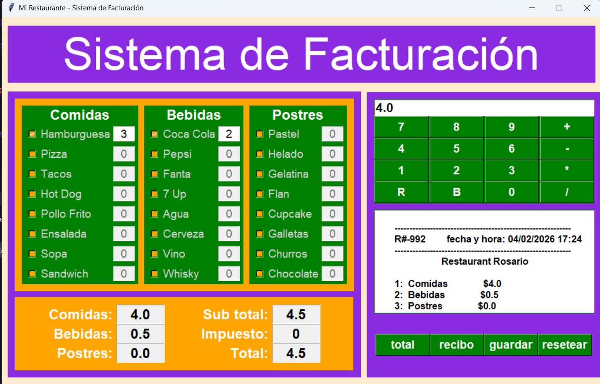

# Sistema de Facturación para Restaurante

Aplicación de escritorio para la gestión de pedidos y facturación de un restaurante. Desarrollada en **Python** con interfaz gráfica **Tkinter**. La idea es simple: tener un sistema de punto de venta (POS) donde se seleccionen productos del menú, se calculen totales con impuestos y se generen recibos.

## Contexto

En un restaurante es necesario llevar un control rápido y eficiente de los pedidos. Este sistema permite al personal seleccionar comidas, bebidas y postres, calcular el total incluyendo impuestos, y generar un recibo que puede guardarse como archivo.

Además, incluye una calculadora integrada para operaciones rápidas sin salir de la aplicación.

## ¿Qué resuelve?

* Agiliza el proceso de toma de pedidos.
* Calcula automáticamente subtotales e impuestos (7%).
* Genera recibos con código único, fecha y hora.
* Permite guardar los recibos en archivos de texto.
* Incluye calculadora para operaciones matemáticas básicas.

## ¿Qué se puede hacer en el sistema?

* **Seleccionar productos**: marcar comidas, bebidas y postres del menú e indicar la cantidad.
* **Calcular totales**: ver el desglose de costos por categoría, subtotal, impuesto y total.
* **Generar recibo**: crear un recibo formateado con código único y fecha/hora.
* **Guardar recibo**: exportar el recibo a un archivo de texto (.txt).
* **Usar calculadora**: realizar operaciones básicas (+, -, *, /) con la calculadora integrada.
* **Resetear**: limpiar todos los campos para un nuevo pedido.

## Capturas de pantalla

**Interfaz principal del sistema**

## Tecnologías

* **Lenguaje:** Python 3.8+
* **Interfaz gráfica:** Tkinter (incluido en Python)
* **Bibliotecas:** datetime, random, re, pathlib (estándar de Python)

## Instalación y ejecución

1. Clonar el repositorio:

        git clone https://github.com/RodrigoRosario345/Proyecto_Sistema_Facturacion_Restaurante_Rosario.git
        cd Proyecto_Sistema_Facturacion_Restaurante_Rosario
        
2. Ejecutar la aplicación:

        python main.py

## Requisitos

* Python 3.8 o superior
* Tkinter (viene incluido con Python en la mayoría de sistemas)

## Estructura del proyecto

    ├── main.py              # Punto de entrada de la aplicación
    ├── config/
    │   ├── settings.py      # Configuración (colores, fuentes, impuestos)
    │   └── menu_data.py     # Datos del menú (productos y precios)
    ├── logic/
    │   ├── billing.py       # Sistema de facturación y recibos
    │   └── calculator.py    # Lógica de la calculadora
    └── ui/
        ├── main_window.py   # Ventana principal
        ├── menu_panel.py    # Panel de selección de productos
        ├── costs_panel.py   # Panel de costos
        ├── calculator_panel.py  # Panel de calculadora
        └── receipt_panel.py # Panel de recibo y botones

## Configuración

* **Modificar precios**: editar `config/menu_data.py`
* **Cambiar impuesto**: editar `TAX_RATE` en `config/settings.py`
* **Personalizar colores**: editar `COLORS` en `config/settings.py`

## Notas

Proyecto desarrollado como práctica del curso Python.
